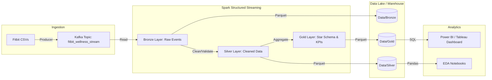

# Real-Time Fitbit Wellness ETL & Analytics Platform

## Project Overview
This project demonstrates a complete end-to-end data engineering and analytics pipeline using the **Fitbit Fitness Tracker Data**. It simulates real-time data ingestion via **Kafka**, processes streams using **Spark Structured Streaming**, and models the data into a **Star Schema** for business intelligence.

**Goal**: Analyze user wellness behavior, identify engagement segments, and provide actionable insights through a modern data stack.

## Architecture



The pipeline consists of four main layers:
1.  **Ingestion**: Python Producer simulates real-time events from CSVs to Kafka.
2.  **Bronze Layer**: Raw data ingestion into Parquet (Spark).
3.  **Silver Layer**: Data cleaning, validation, and deduplication.
4.  **Gold Layer**: Aggregated Star Schema tables for high-performance analytics.

## Tech Stack
- **Languages**: Python, SQL
- **Streaming**: Apache Kafka, Spark Structured Streaming (PySpark)
- **Storage**: Parquet (Data Lake)
- **Analytics**: Pandas, Matplotlib (EDA)
- **Visualization**: Power BI / Tableau (Ready)

## Directory Structure
```
├── data/               # Data Lake storage (Bronze/Silver/Gold)
├── docs/               # Documentation & Diagrams
├── etl/                # Spark ETL Jobs
├── kafka/              # Kafka Producer Scripts
├── notebooks/          # EDA & Analysis Scripts
├── sql/                # SQL DDL & Queries
└── README.md           # Project Documentation
```

## Setup & Usage

### Prerequisites
- Python 3.8+
- Apache Kafka (Running locally on `localhost:9092`)
- Apache Spark (PySpark)

### 1. Install Dependencies
```bash
pip install pyspark kafka-python pandas matplotlib seaborn
```

### 2. Prepare Data
Download the [Fitbit Fitness Tracker Data](https://www.kaggle.com/datasets/arashnic/fitbit) and place the unzipped CSV files in `data/raw`.

### 3. Start Kafka Environment
Ensure Zookeeper and Kafka Broker are running.
```bash
# Example (if using Confluent or Homebrew)
zookeeper-server-start /usr/local/etc/kafka/zookeeper.properties
kafka-server-start /usr/local/etc/kafka/server.properties
```

### 4. Run the Pipeline
**Terminal 1: Start ETL Consumer**
```bash
python etl/stream_processor.py
```

**Terminal 2: Start Data Producer**
```bash
python kafka/producer.py
```

### 5. Analytics & Dashboarding
View the Tableau Dashboard 

## Key Insights & KPIs
- **Wellness Score**: Composite metric of Activity + Sleep.
- **Engagement Segments**: Users classified as High, Medium, or Low engagement based on daily active minutes.
- **Sleep Efficiency**: Correlation analysis between time in bed vs. actual sleep.

## Future Improvements
- **Airflow Orchestration**: Schedule batch backfills.
- **Cloud Deployment**: Move to AWS EMR or Databricks.
- **Real-time Alerts**: Notify users when they hit daily goals via Kafka consumer.
